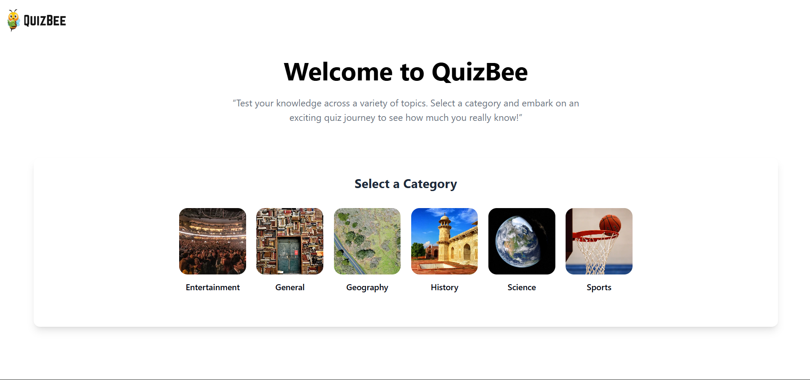
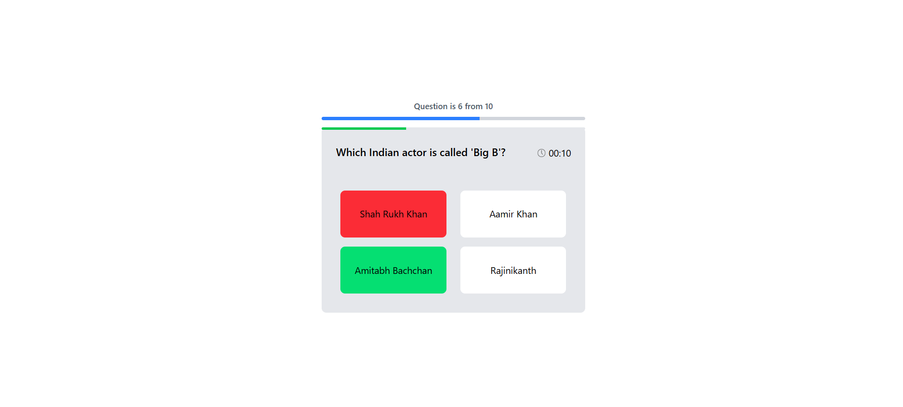
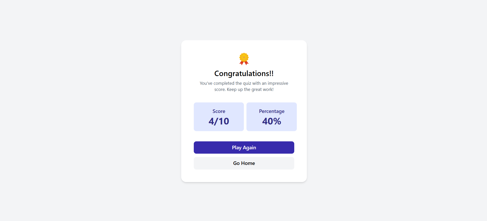

# QuizBee 🎯

An interactive quiz app built with **React** and **TailwindCSS** where users can test their knowledge across multiple categories.  

## 🚀 Features
- Choose from multiple quiz categories  
- Countdown **timer bar** for each question  
- **Answer validation**:  
  - Selected answer turns **green** if correct  
  - Selected answer turns **red** if wrong, while the correct answer also shows in **green**  
- Dynamic scoring system  
- Responsive design (mobile & desktop)  
- Smooth transitions and modern UI  

## 🛠️ Tech Stack
- **React** – Frontend framework  
- **TailwindCSS** – Styling  
- **Vite** – Development & bundling  

### Home Page

### Question Example

### Result Screen

### Live link 
- https://quiz-bee-1.vercel.app/