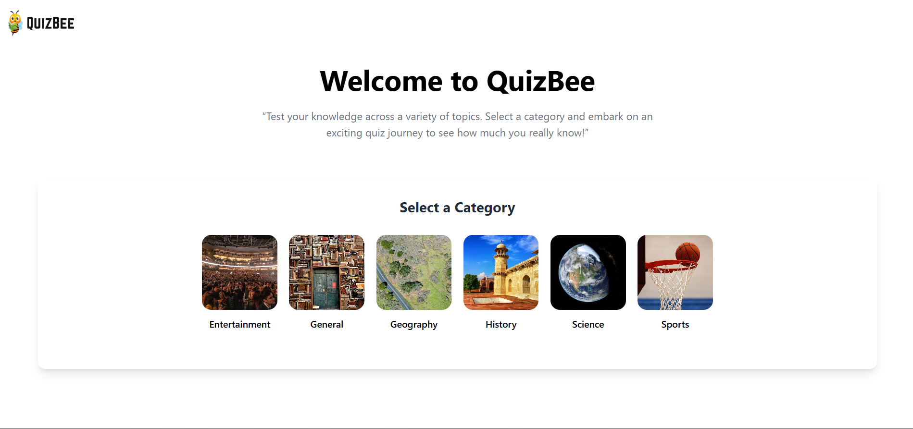
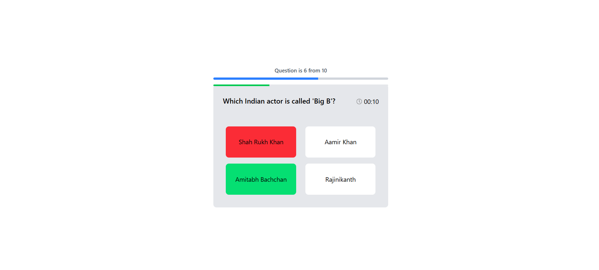
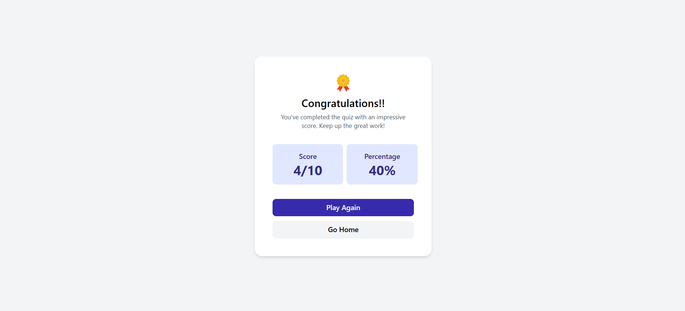

QuizBee is a simple and fun quiz application built using React and Tailwind CSS.  
Users can attempt quizzes, switch categories, and track their scores.

## 🎯 Features
- Interactive quiz flow
- Category selection
- Score calculation
- State-based screen transitions
- Responsive UI design

## 🛠️ Tech Stack
- React
- Tailwind CSS
- Vite

### Home Page


### Question Example


### Result Screen


### Live link 
https://quiz-bee-1.vercel.app/

## 📂 GitHub Repository
https://github.com/itsgauravkumar07/QuizBee

## 📘 What I Learned
- Managing state effectively using React
- Structuring UI using Tailwind CSS
- Creating reusable components
- Handling user interactions and dynamic UI

## 📦 Setup & Installation

```bash
git clone https://github.com/itsgauravkumar07/QuizBee.git  
cd QuizBee 
npm install  
npm run dev
